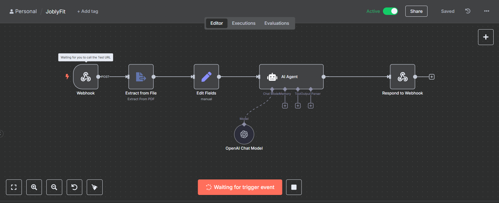

# JoblyFit

JoblyFit is a web application that analyzes your resume against a job description using AI to provide personalized feedback on how well your qualifications match the role. All processing happens locally on your machine, ensuring your personal data remains private and secure.

**Demo Video:**


**n8n Workflow Setup Screenshot:**



## Features

- **Resume Upload**: Upload your resume in PDF, DOC, or DOCX format
- **Job Analysis**: Enter job title and description for comprehensive analysis
- **AI-Powered Feedback**: Leverages AI (via n8n workflow and local LM Studio LLM) to provide detailed match analysis, strengths, gaps, and improvement suggestions
- **Dark/Light Theme**: Toggle between themes for better readability
- **Responsive Design**: Works on desktop and mobile devices
- **Webhook Integration**: Communicates with n8n automation workflow for backend processing

## How It Works

1. User fills out the job title, job description, and uploads their resume on the main page
2. Form data is temporarily stored and user is redirected to loading page
3. Frontend sends POST request to n8n webhook with form data
4. n8n workflow:
   - Extracts text from uploaded resume (PDF processing)
   - Sets up data for AI analysis
   - Uses AI Agent to compare resume with job description
   - Generates analysis covering:
     - How well resume matches the role
     - Key strengths and relevant skills
     - Important missing skills/experiences
     - Overall fit summary and suggestions
5. AI response is returned to frontend and displayed to user

## Prerequisites

- n8n (running locally on port 5678)
- LM Studio (for local LLM inference)
- Web browser with JavaScript enabled
- Local web server (for serving HTML files, e.g., Python's http.server, VS Code Live Server, etc.)

## Installation & Setup

### 1. n8n Workflow Setup

1. Import `JoblyFit.json` into your n8n instance:
   ```
   n8n import --file JoblyFit.json
   ```

2. Configure LM Studio as the LLM:
   - In the n8n workflow, replace the "OpenAI Chat Model" node with an appropriate node for LM Studio or local LLM API
   - Ensure your local LLM is accessible and properly integrated
   - **Note**: The exported workflow has OpenAI credentials removed for security. You must configure your own LLM connection.

3. Activate the workflow in n8n

### 2. Frontend Setup

1. Clone or download this repository

2. Serve the HTML files using a local web server:
   ```bash
   # Using Python 3
   python3 -m http.server 8000

   # Or using Node.js (if installed)
   npx serve
   ```

3. Open your browser and navigate to `http://localhost:8000` (or your server port)

### 3. LM Studio Setup

1. Install and run LM Studio
2. Download an appropriate LLM model (e.g., GPT-2, Llama, etc.)
3. Start the local server in LM Studio (typically on port 1234)
4. Ensure n8n is configured to use the local LM Studio endpoint instead of OpenAI

## Usage

1. Open `index.html` in your browser
2. Fill in the job title
3. Paste the complete job description
4. Upload your resume (PDF, DOC, or DOCX)
5. Click "Submit"
6. Wait for analysis (may take 30-60 seconds)
7. Review the detailed AI-generated feedback
8. Submit another analysis or adjust your resume based on suggestions

## File Structure

- `index.html` - Main form page
- `loading.html` - Loading screen and results display
- `script.js` - Frontend form handling and data storage
- `loading.js` - API call to n8n webhook and result processing
- `styles.css` - Styling for dark/light themes, animations, and responsive design
- `JoblyFit.json` - n8n workflow configuration

## Technical Details

- **Frontend**: Pure HTML/CSS/JavaScript (no framework dependencies)
- **Backend**: n8n automation platform with local webhook
- **AI Integration**: LangChain-based agent running on local LM Studio LLM
- **File Processing**: PDF text extraction using n8n nodes
- **Themes**: localStorage for theme persistence
- **Data Transfer**: FormData with base64-encoded files (temporary localStorage storage)

## Customization

- **Workflow**: Modify `JoblyFit.json` to change AI prompts, add nodes, or integrate different LLMs
- **Styling**: Edit `styles.css` to customize appearance
- **Themes**: Add more theme options or dynamic styling
- **Features**: Extend with additional form fields or analysis types

## Troubleshooting

- **Webhook Connection**: Ensure n8n is running on `http://localhost:5678` and webhook path matches
- **LM Studio**: Verify local LLM server is running and accessible
- **File Upload**: Check supported formats (PDF, DOC, DOCX) and file size limits
- **Timeout**: Analysis may take time with larger resumes or slower LLMs
- **Browser Issues**: Test in modern browsers with cross-origin access enabled for local development

## Privacy & Security

JoblyFit is a web application that analyzes your resume against a job description using local AI to provide personalized feedback on how well your qualifications match the role—all without compromising your privacy.

JoblyFit prioritizes your privacy by processing all data locally:

- **Local Processing**: All AI analysis runs entirely on your local machine using LM Studio
- **No External Transmission**: Resume content and job descriptions are never sent to external servers
- **Temporary Storage**: Form data is stored only in browser localStorage during submission and cleared after analysis
- **Webhook Communication**: Data transfer occurs locally between frontend and n8n (localhost only)
- **No Cloud Dependencies**: No internet connection required once local services are set up

Your personal resume information remains secure and private throughout the entire process.

## Contributing

Feel free to submit issues, feature requests, or pull requests to improve JoblyFit.

## License

This project is open source. Use it how you like!

## Disclaimer

This tool provides AI-generated suggestions. Use professional judgment for career decisions. Results are not guaranteed and may vary based on LLM capabilities and job market conditions.
